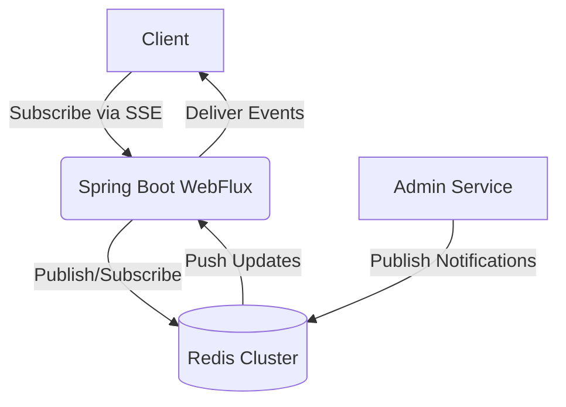

# Real-Time Notification System with SSE, Spring WebFlux & Redis

*A scalable real-time notification system using reactive Spring Boot and Redis Pub/Sub*

---

## 🌟 Key Features

- **Real-time push notifications** using Server-Sent Events (SSE)
- **Reactive Spring Boot** backend (non-blocking I/O)
- **Redis Pub/Sub** for cross-instance messaging
- **Auto-reconnection** with exponential backoff
- **Heartbeat monitoring** to keep connections alive
- **Scalable to 10,000+ concurrent connections** per instance

---

## 🏗️ System Architecture



**Flow**: Client → Spring Boot (SSE) → Redis Pub/Sub → Other Clients

---

## 🚀 Quick Start

### Prerequisites

- Java 21+
- Docker (for Redis)
- Maven

### Clone & Run

```bash
git clone https://github.com/vinodjagwani/sse-demo.git
cd sse-demo
mvn clean install
mvn spring-boot:run
```

---

## 🌐 API Endpoints

### Subscribe to Notifications

**GET** `/api/notifications/stream/{userId}`

```bash
curl -N http://localhost:8080/api/notifications/stream/user123
```

### Send Notification

```bash
curl -X POST http://localhost:8080/api/notifications   -H "Content-Type: application/json"   -d '{
    "id": "1",
    "userId": "user123",
    "message": "Hello from SSE!",
    "timestamp": "2023-05-01T12:00:00Z",
    "read": false
  }'
```

---

## 🛠️ Build Options

### Run with tests

```bash
mvn clean install
```

### Skip tests

```bash
mvn clean install -DskipTests
```

---

## 🐳 Docker Deployment

```bash
docker-compose up -d --build
```

---

## 🧑‍💻 Development Guide

### Code Structure

```
com.sse.example
├── config/             # Redis, WebFlux config
├── controller/         # REST endpoints
├── dto/                # Data transfer objects
├── exception/          # Exception handling
├── filter/             # Web filters
├── service/            # Business logic
└── Application.java    # Main application class
```

---

## 📚 Documentation

### Technology Stack

- **Spring WebFlux** – Reactive web framework  
- **Redis Pub/Sub** – Real-time messaging  
- **Project Reactor** – Reactive streams
